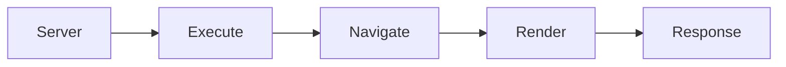
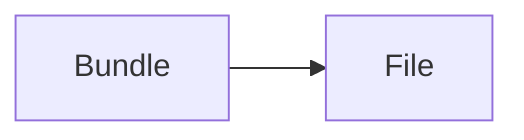

# @wal-li/page

## Getting Started

```bash
npm i -g @wal-li/page
```

```bash
wlp serve <project-dir>
```

```bash
wlp bundle <project-dir> <output-file>
```

## Concept

**Serve**



**Bundle**



## Author

HaoVA <hi@haova.me> (https://www.haova.me)

## License

MIT.
