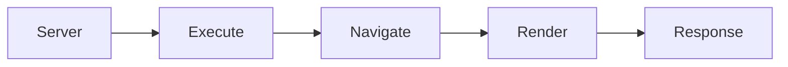

# @wal-li/page

## Getting Started

```bash
npm i -g @wal-li/page
```

```bash
wlp serve <project-dir>
```

```bash
wlp bundle <project-dir> <output-file>
```

## Concept

**Serve**



**Bundle**


**Render**

- Render WLP script and view and return an object contains script and view results.
- `exports.handler` will run first and the result is placed into `result`. This variable can access in the view content.
- The view content can access:
  - `context`
  - `result`
  - `exports`
  - `dump`
  - `request`

**Navigate**

- Handle routes in givens WLP and return a HTTP response object.
- Default route is `/`.
- If `layout` is used, the final result is the layout result.

`Not Found` cases:

- No matched route.
- Is template but no template found.
- Has layout but no layout found.
- No `script` result and no `view` result.

Response:

- `status`: `script.status` or `200` (if has body) or `404` (without body).
- `body`: `view` or `script.body` or empty (if has status) or `Not Found` (no status).
- `headers`: `script.headers` or auto headers based on body.

**Execute**

Parse and execute WLP content and return a HTTP response object.

## Author

HaoVA <hi@haova.me> (https://www.haova.me)

## License

MIT.
